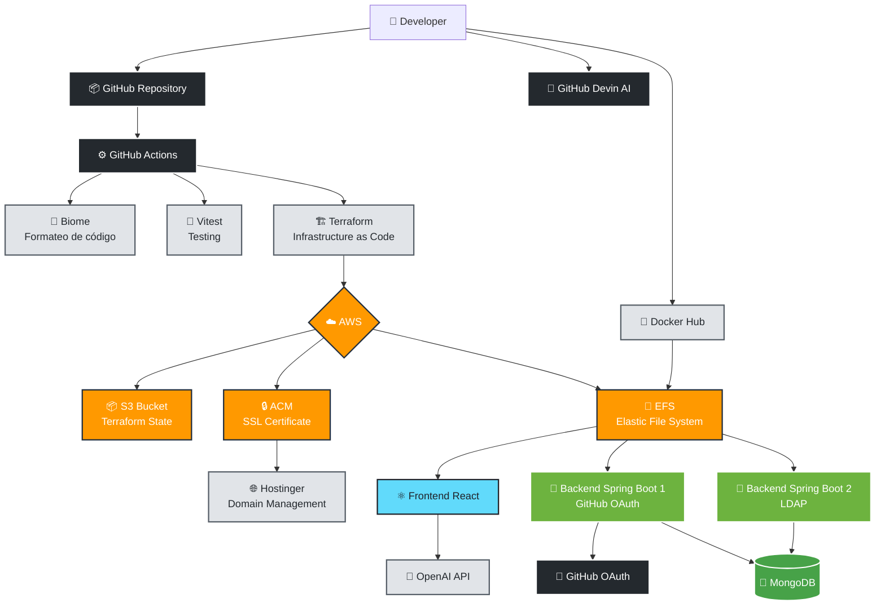

# Just Doc It - Documentación del Proyecto


## Extras

-  Para cualquier duda de la estructura, aquí se proporciona una documentación creada por IA a la cual se le puede preguntar cualquier cuestión del proyecto: [Link AI](https://deepwiki.com/erik-tortarod/JustDocIt/1-overview)
-  Diseño de Figma: [Link Figma](https://www.figma.com/design/DDN1a1kKOHmwWRiycK7Jdt/Clase-Dise%C3%B1o-Web?node-id=0-1&t=akoh8G6NbL1P3Z6U-1)

## Índice de Contenidos

1. [Finalidad de la web](#1-descripción-de-la-finalidad-de-la-web)
2. [Guía de Instalación y Uso](#2-cómo-instalar-y-ejecutar-el-proyecto)
3. [Tecnologías empleadas](#3-tecnologías-empleadas)
4. [Diagrama de la infraestructura](#4-diagrama-infraestructura)

## 1. Descripción de la Finalidad de la Web

Just Doc It es una plataforma innovadora diseñada para simplificar y automatizar el proceso de documentación de código. Su objetivo principal es eliminar la complejidad tradicional asociada con la documentación de software, ofreciendo una solución integral que:

-  **Automatiza la Documentación**: Genera documentación de código de manera automática sin necesidad de configuración manual.
-  **Soporta Múltiples Lenguajes**: Permite documentar código de diferentes lenguajes de programación desde una única plataforma.
-  **Integración con Github**: Facilita el acceso y documentación de repositorios tanto públicos como privados mediante autenticación OAuth2.
-  **Despliegue Automático**: Genera y despliega automáticamente sitios web estáticos con la documentación.
-  **Integración con IA**: Todo el código que no esté documentado a mano, se le puede dar a una IA para que lo documente detalladamente en vivo, creando diagramas y explicaciones claras de cada detalle de tu código.

## 2. Cómo instalar y ejecutar el proyecto

### Clonar el repositorio

Primero, clona el repositorio de Just Doc It, trabajaremos en la rama _dev_:

```bash
git clone https://github.com/erik-tortarod/JustDocIt.git
```

### Configurar Credenciales OpenAI

La **API_KEY** de de OpenAI actual es esta, se encuentra en el archivo : `manual_proyecto.pdf`

Copiala y pegala en el **Makefile**, justo donde pone _OPENAI_API_KEY_.

Esta clave solo tiene 5€ por lo que si no funciona probablemente se deba a que se ha quedado sin presupuesto.

### Construye el proyecto con Docker

Para evitar tener que instalarte JDK, npm o cualquier cosa, se han implementado una serie de _Dockerfile_ para así poder fácilmente desplegar y destruir todo, simplemente haz en el directorio raiz el comando `make help` y tendrás todas las instrucciones como:

-  Construir y desplegar `make rebuild-all`
-  Detener contenedores `make stop-all`
-  Ver logs `make logs-CONTENEDOR`

### Dirígete a http://localhost

## 3. Tecnologías empleadas

A continuación, se detallan las tecnologías empleadas en el proyecto, organizadas por categorías:

### **Frontend**

| Tecnología | Descripción                                                                        |
| ---------- | ---------------------------------------------------------------------------------- |
| React      | Librería de JavaScript para construir interfaces de usuario                        |
| TypeScript | Superconjunto de JavaScript que añade tipado estático                              |
| Vite       | Herramienta de construcción rápida para proyectos web modernos                     |
| BiomeJS    | Formateador y linter de código para JavaScript/TypeScript                          |
| Framer     | Librería para animaciones y prototipos interactivos                                |
| i18n       | Librería para internacionalización (manejo de múltiples idiomas)                   |
| Lucide     | Conjunto de iconos de código abierto personalizables                               |
| Mermaid    | Herramienta basada en Markdown para generar diagramas y gráficos a partir de texto |
| PrismJS    | Un resaltador de sintaxis ligero, robusto y extensible                             |

### **Diseño**

| Tecnología            | Descripción                                                                   |
| --------------------- | ----------------------------------------------------------------------------- |
| Tailwind CSS          | Framework CSS de utilidad para construir diseños personalizados rápidamente   |
| DaisyUI               | Librería de componentes para Tailwind CSS                                     |
| Figma                 | Herramienta de diseño de interfaz y prototipado colaborativo                  |
| Google Search Console | Herramienta de Google para monitorear el rendimiento del sitio en la búsqueda |
| Metodología BEM       | (Block, Element, Modifier) Metodología para nombrar clases CSS                |

### **Servidor**

| Tecnología            | Descripción                                                                                           |
| --------------------- | ----------------------------------------------------------------------------------------------------- |
| JWT (JSON Web Tokens) | Estándar abierto para la creación de tokens de acceso                                                 |
| OAuth2                | Framework de autorización que permite a las aplicaciones obtener acceso limitado a cuentas de usuario |
| MongoDB               | Base de datos NoSQL basada en documentos                                                              |
| LDAP Security         | Protocolo para acceder y mantener servicios de información de directorio distribuido                  |
| Lombok                | Librería de Java que ayuda a reducir el código repetitivo (boilerplate)                               |
| iTextPDF              | Librería para crear y manipular documentos PDF                                                        |
| Java Format           | Formatear y Lintear el código de Java                                                                 |

### **Despliegue**

| Tecnología                  | Descripción                                                 |
| --------------------------- | ----------------------------------------------------------- |
| AWS (Amazon Web Services)   | Plataforma de servicios en la nube                          |
| EFS (Elastic File System)   | Servicio de almacenamiento de archivos escalable            |
| ACM (Certificate Manager)   | Servicio para gestionar certificados SSL/TLS                |
| S3 (Simple Storage Service) | Almacenamiento de objetos escalable                         |
| Vitest                      | Framework de pruebas unitarias compatible con Vite          |
| Playwright                  | Framework de automatización de pruebas de extremo a extremo |
| GitHub Actions              | Plataforma de CI/CD para automatizar flujos de trabajo      |
| MongoDB Atlas               | Servicio de base de datos MongoDB en la nube                |
| Terraform                   | Herramienta para CI/CD                                      |

### **Otras**

| Tecnología | Descripción                                                            |
| ---------- | ---------------------------------------------------------------------- |
| Devin AI   | Asistente de IA para desarrollo                                        |
| GitBook    | Plataforma para documentar y publicar contenido                        |
| Scribe     | Herramienta para crear guías paso a paso automáticamente               |
| OpenAI/Ollama     | API de inteligencia artificial para documentación y análisis de código |

## 4. Diagrama infraestructura


